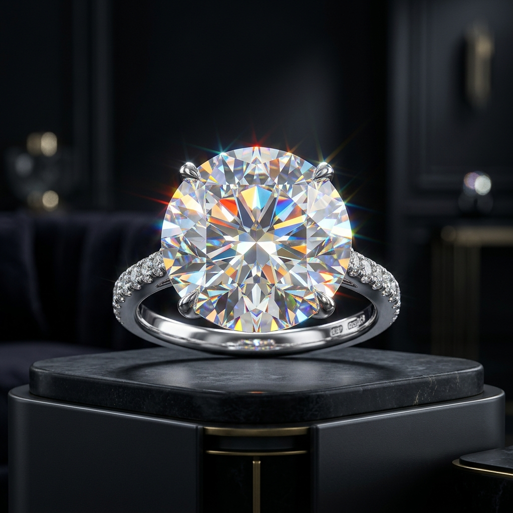
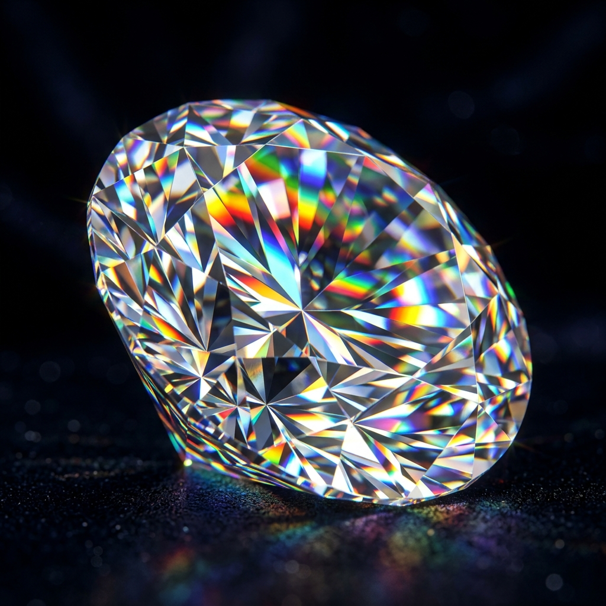
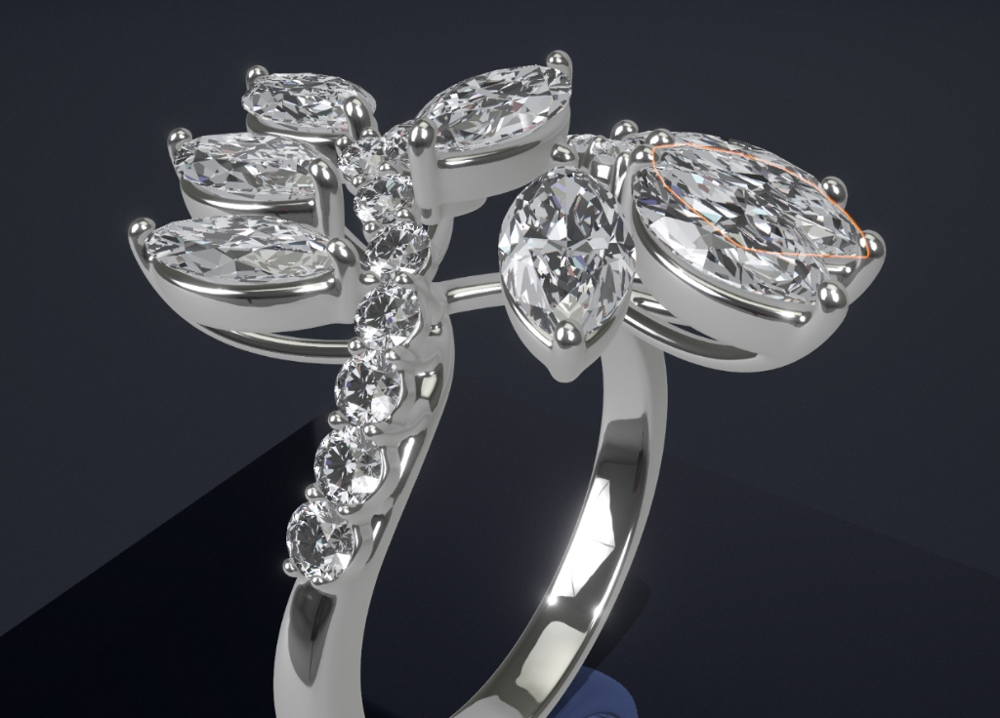
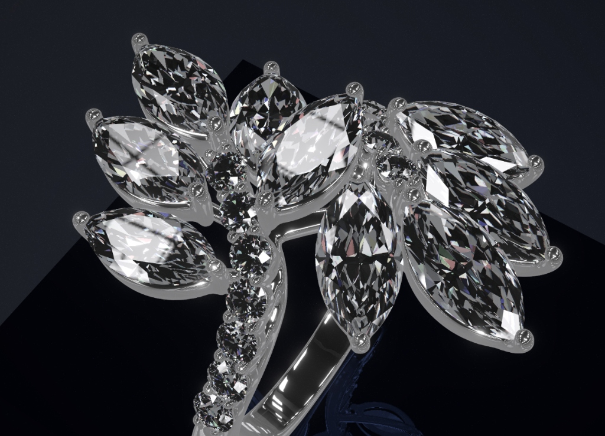
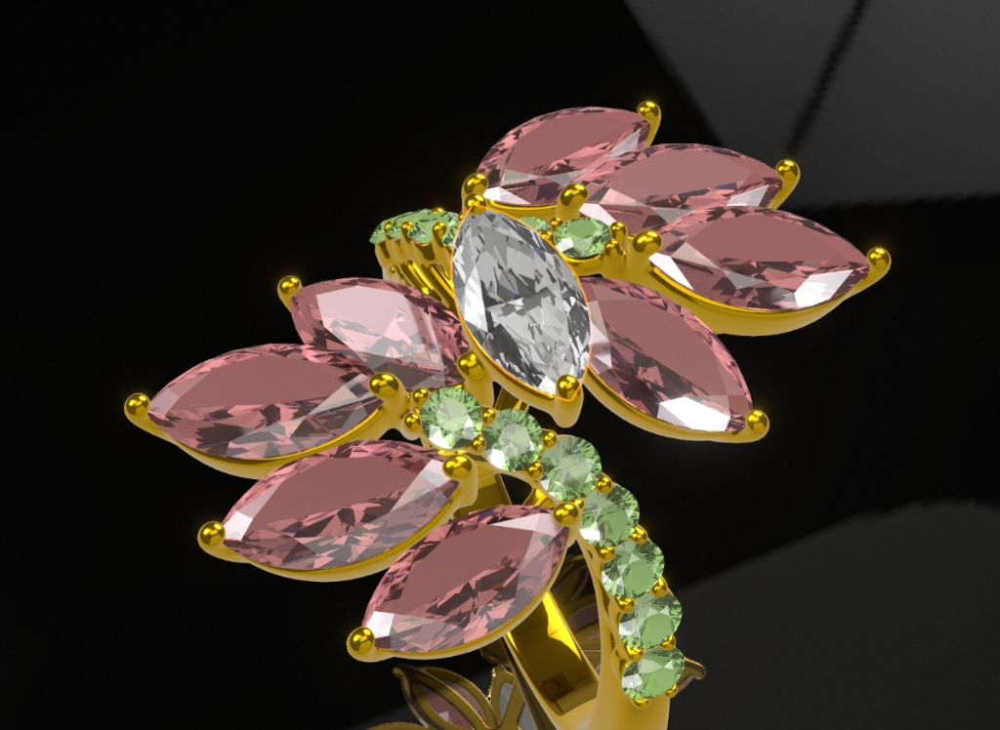

# 💎 AurumStudio — Real-Time 3D Diamond & Jewelry Raytracing Engine

<div align="center">


**An enterprise-grade, real-time physically based 3D jewelry configurator and optical diamond rendering engine built for the web.**

[Explore Live Demo](#getting-started) • [The Problem & Solution](#the-problem--solution) • [How Diamond Physics Work](#deep-dive-how-diamond-rendering-works) • [Architecture](#technical-architecture)

---

</div>

## 🌟 Showcase & Rendered Gallery

Our engine produces stunning, photorealistic optical renders in real-time directly within the browser without requiring external offline rendering suites (like V-Ray or Blender Cycles). 

### 🔥 Real-Time Physically Based Rendering (PBR) & Optical Fire
<div align="center">
  
  <p><em>Real-time 3D rendering of a luxury brilliant-cut diamond ring featuring multi-bounce total internal reflection, high IOR refraction, and rainbow chromatic dispersion.</em></p>
</div>

### 🔬 Macro Optical Dispersion & Table Reflections
<div align="center">
  
  <p><em>Close-up macro simulation demonstrating chromatic aberration (fire) and high-angle pavilion internal reflections.</em></p>
</div>

### 💍 Curated Jewelry Design Catalog
The configurator allows instant switching across bespoke jewelry designs, dynamic metal finishes, and gemstone varieties:

| **Solitaire Elegance** | **Halo Brilliance** | **Royal Sapphire Pavé** | **Emerald Cut Lux** |
|:---:|:---:|:---:|:---:|
|  |  |  |  |
| *18K Yellow Gold Solitaire* | *Platinum Diamond Halo* | *Royal Blue Sapphire Pavé* | *18K Rose Gold Emerald Cut* |

---

## ⚡ The Problem & Solution

### ❌ The Problem: Why Conventional WebGL Fails for Diamonds
In standard 3D web graphics (WebGL / Three.js), rendering transparent objects relies on **surface-level rasterization** and standard alpha blending. While this works well for simple glass or water, it completely fails when simulating high-refractive-index gemstones like diamonds:

1. **The "Hollow Glass" Illusion**: Standard PBR materials only render the outer surface shell of a mesh. Because light is not traced through the internal volume of the gemstone, diamonds appear flat, dark, and hollow, indistinguishable from cheap glass beads or plastic.
2. **Missing Optical Physics**: Brilliant diamonds owe their beauty to **Total Internal Reflection (TIR)** and **Chromatic Dispersion (Fire)**—light must enter the top table, bounce multiple times off the angled bottom pavilion facets like a mirror, split into rainbow wavelengths, and shoot back out toward the viewer's eye. Standard shaders cannot perform multi-bounce internal light tracing.
3. **The GPU Performance Wall**: Attempting brute-force raytracing against a multi-thousand-facet diamond geometry inside a web browser fragment shader causes an $O(N)$ computational explosion, instantly degrading frame rates to under **1 FPS** and freezing mobile devices.

---

### ✅ The Solution: Real-Time BVH Hardware-Accelerated Raytracing
**AurumStudio** abandons conventional rasterized transparency and implements a custom **Real-Time Bounding Volume Hierarchy (BVH) Raytracing Engine** integrated with React Three Fiber and Three.js (`three-mesh-bvh`).

```
[ Light Source / PMREM HDR Studio ]
              │
              ▼
   ( Light Enters Crown / Table )
              │
              ▼
 ┌─────────────────────────────────────────┐
 │   BVH-Accelerated Fragment Shader       │
 │                                         │
 │  1. Refraction Bending (IOR = 2.417)    │
 │  2. Multi-Bounce Traversal (TIR Loop)   │
 │  3. Wavelength Splitting (RGB Fire)     │
 └─────────────────────────────────────────┘
              │
              ▼
   ( Brilliant Rainbow Flash to Camera Eye )
```

1. **Spatial Acceleration ($O(\log N)$)**: Upon loading a gemstone model, our engine pre-computes a spatial Bounding Volume Hierarchy tree. Instead of checking every triangle on every frame, the GPU evaluates ray-box intersections logarithmically, enabling real-time raytracing at a silky smooth **60 FPS** across desktop and mobile devices.
2. **Multi-Bounce Internal Shader**: Our custom `DiamondBVHMaterial` executes a bounded loop inside the WebGL 2.0 fragment shader, accurately simulating light entering the gem, bending sharply, bouncing off internal facets, and exiting to the camera.
3. **True Physical Chromatic Dispersion**: By calculating separate refractive indices for Red, Green, and Blue light channels, the engine recreates authentic diamond "fire" without relying on pre-rendered textures or fake post-processing overlays.

---

## 💎 Deep Dive: How Diamond Rendering Works

To achieve photorealism, our rendering pipeline simulates five fundamental physical laws of gemstone optics:

### 1. Extreme Index of Refraction (IOR = 2.417)
The **Index of Refraction (IOR)** measures how drastically light decelerates and bends when transitioning from air into a dense medium:
* **Air**: $1.00$
* **Water**: $\approx 1.33$
* **Glass**: $\approx 1.50$
* **Diamond**: **$2.417$** (One of the highest optical densities in nature)

In our shader implementation (`DiamondBVHMaterial.jsx`), the incoming vector from the camera is transformed via `refract(ray, normal, ior)`. Because diamond's IOR is so extreme, entering rays bend sharply toward the internal center, striking the angled bottom pavilion facets at extremely steep angles.

### 2. Total Internal Reflection (TIR)
In a properly cut brilliant diamond, light entering from the top must not escape through the bottom. When an internal ray strikes a boundary facet at an angle exceeding the **Critical Angle** ($\approx 24.4^\circ$ for diamond), refraction becomes impossible ($> 90^\circ$ refraction angle). 

Instead, **Total Internal Reflection (TIR)** occurs: the internal facet acts as a 100% efficient mirror. Our shader models this with an iterative raytracing loop:
```glsl
// Simplified extract of the multi-bounce TIR loop inside DiamondBVHMaterial
for (int i = 0; i < MAX_BOUNCES; i++) {
    bool hit = bvhIntersectFirstHit(rayOrigin, rayDirection, hitNormal);
    if (!hit) break; // Light escaped to environment
    
    // Calculate outgoing refraction vector
    vec3 refracted = refract(rayDirection, hitNormal, 1.0 / ior);
    
    // If length is 0.0, TIR occurred! Reflect internally like a mirror.
    if (length(refracted) == 0.0) {
        rayDirection = reflect(rayDirection, hitNormal);
    } else {
        // Light escaped the gemstone; sample the studio environment map
        return samplePMREM(refracted);
    }
}
```

### 3. Chromatic Aberration & Optical Fire (`aberrationStrength`)
Because refractive density varies slightly depending on light wavelength (higher for short violet/blue waves, lower for long red waves), white light passing through a diamond splits into distinct rainbow colors—a phenomenon known as **Dispersion** or **Fire**.

Our engine simulates this by offsetting the uniform `ior` across three separate ray paths:
* **Red Channel Path**: Evaluates ray traversal using `ior * (1.0 - aberrationStrength)`
* **Green Channel Path**: Evaluates ray traversal using standard `ior`
* **Blue Channel Path**: Evaluates ray traversal using `ior * (1.0 + aberrationStrength)`

Recombining these three distinct ray exits produces natural, dynamic rainbow sparkles as the ring rotates in 3D space.

### 4. Table Specular Flashes & Crown Brilliance
A diamond's flat top **Table** and upper **Crown** facets act as direct reflectors for overhead studio lighting. We implement a specialized Fresnel reflection model:
$$\text{Fresnel Reflection} = (1.0 - \max(0.0, N \cdot V))^4$$
When combined with a custom high-dynamic-range (HDR) Prefiltered Mipmapped Radiance Environment Map (PMREM) studio strip texture (`getStudioStripTexture()`), the table reflects sharp, blindingly bright specular white flashes that contrast dramatically against the colored internal volume.

### 5. BVH Spatial Tree Optimization
Without spatial indexing, testing 1 ray against a 5,000-polygon gemstone requires 5,000 checks. For a $1920 \times 1080$ screen, that equals **10 billion checks per frame**.

By structuring the mesh into a **Bounding Volume Hierarchy (`three-mesh-bvh`)**, triangles are grouped into nested axis-aligned bounding boxes (AABBs). The shader first tests the largest outer box; if the ray misses, thousands of triangles are discarded instantly. This reduces computational complexity from $O(N)$ linear search to $O(\log N)$ tree traversal, ensuring 60 FPS performance even on mobile GPUs.

---

## 🛠️ Technical Architecture

The codebase follows a modular, reactive design pattern built on the modern React Three Fiber stack:

```
diamond-r3f-master/
├── public/
│   ├── hdri/                  # High-resolution HDR environment studio maps
│   ├── images/                # Rendered jewelry showcase & design thumbnails
│   └── *.glb                  # 3D Jewelry geometry assets (ring.glb, etc.)
├── src/
│   ├── App.jsx                # Global state orchestrator & UI/Scene router
│   ├── LandingPage.jsx        # Mobile-first responsive luxury marketing interface
│   ├── Dashboard.jsx          # 3D Configurator workspace & interactive controls
│   ├── DiamondBundle.jsx      # Gemstone mesh instantiation & R3F useFrame sync
│   ├── DiamondBVHMaterial.jsx # Custom WebGL 2.0 raytracing shader & BVH logic
│   ├── RightPanel.jsx         # Real-time material inspector & physics parameters
│   └── TopBar.jsx             # Navigation header & responsive mobile menu
└── docs/                      # Comprehensive technical architecture reports
```

### State-to-GPU Synchronization
To prevent React re-renders from stuttering the 3D canvas, we separate UI state from GPU memory:
1. User adjusts sliders (IOR, Aberration, Metal Roughness) in `RightPanel.jsx`.
2. `App.jsx` updates centralized state atoms.
3. Inside `DiamondBundle.jsx`, React Three Fiber's `useFrame` hook blindly pushes updated values directly into the native WebGL shader uniforms (`material.uniforms.ior.value = newIor`) at 60 FPS, bypassing React DOM reconciliation entirely.

---

## 🚀 Getting Started

### Prerequisites
* **Node.js**: v18.0.0 or higher
* **npm** or **yarn** or **pnpm**

### Installation & Setup

1. **Clone the repository**:
   ```bash
   git clone https://github.com/Meet9510/diamond-r3f.git
   cd diamond-r3f-master
   ```

2. **Install project dependencies**:
   ```bash
   npm install
   ```

3. **Launch the local development server**:
   ```bash
   npm run dev
   ```
   Open your browser and navigate to `http://localhost:5174` (or the port specified in your console).

4. **Build for Production**:
   ```bash
   npm run build
   ```
   This generates an optimized, tree-shaken static distribution in the `/dist` directory ready for deployment on Vercel, Netlify, or AWS Amplify.

---

## 🕹️ Interactive Features in the Configurator

* **Dynamic Metal Alloys**: Switch seamlessly between **18K Yellow Gold**, **Rose Gold**, **Platinum / White Gold**, and **Black Onyx** with adjustable roughness and metalness curves.
* **Gemstone Selection**: Customize the center gemstone from **Brilliant White Diamond**, **Royal Blue Sapphire**, **Colombian Emerald**, **Pigeon Blood Ruby**, or **Fancy Yellow Diamond**.
* **Real-Time Physics Controls**: Adjust Index of Refraction (IOR), internal bounce limits ($1 \text{ to } 8$), chromatic aberration intensity, and Fresnel crown reflections in real-time.
* **Studio Stage Presets**: Toggle between luxury dark pedestals, clean minimalist white studios, and dramatic cinematic spotlighting.
* **Responsive Mobile-First UI**: Fully functional across desktop monitors, tablets, and smartphones with custom touch controls and hamburger navigation.

---

## 📖 Documentation & Technical Reports

For deeper insights into mathematical formulas, shader code breakdowns, and optimization benchmarks, explore our comprehensive technical reports located in the `/docs` directory:
* [Report 1: Technical Architecture Report](./docs/Report_1_Technical_Architecture.md)
* [Report 2: Diamond Physics & Raytracing Report](./docs/Report_2_Diamond_Physics.md)
* [Report 3: Performance & GPU Optimization Report](./docs/Report_3_Performance_Optimization.md)
* [Report 4: Complete Code Documentation](./docs/Report_4_Code_Documentation.md)
* [Report 5: Presentation & Executive Summary](./docs/Report_5_Presentation_Summary.md)

---

## 👨‍💻 Developed By

**Meet R. Kakadiya** — *Lead 3D Graphics & Creative Developer*
* **GitHub**: [@Meet9510](https://github.com/Meet9510)
* **Project Studio**: AurumStudio / Kakadiya Graphics

---

## 📝 License

This project is licensed under the **MIT License**. Feel free to use, modify, and distribute for educational and commercial purposes with attribution.
